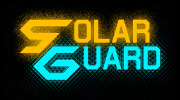

# About

A [homebrew](https://en.wikipedia.org/wiki/Homebrew_(video_games)) [Game Boy Advance](https://en.wikipedia.org/wiki/Game_Boy_Advance) game made for [GBA Jam 2021](https://itch.io/jam/gbajam21).

The game is a space shooter where you complete various missions. These missions take place in the solar system.

This game is in a state of development (i.e. any build thus far can be considered a development version as the game is not feature/content complete).

This game was made using [GValiente](https://github.com/GValiente)'s [Butano](https://github.com/GValiente/butano) engine).

> Butano is a modern C++ high level engine for the [Game Boy Advance](https://en.wikipedia.org/wiki/Game_Boy_Advance).

# Running the Game

## Using a GBA Emulator on PC

To run the game, download a GBA emulator and point it to the `.gba` file.

The [Butano Docs](https://gvaliente.github.io/butano/) recommend [mGBA](https://mgba.io/) and the debug version of [No$gba](https://problemkaputt.de/gba.htm) for testing during development.
> For developing GBA games, [mGBA](https://mgba.io/) and the debug version of [No$gba](https://problemkaputt.de/gba.htm) are recommended.

This doesn't mean these GBA emulators are just tools for development, they can be used to just play GBA games. The [Butano Docs](https://gvaliente.github.io/butano/) refers to the debug version of [No$gba](https://problemkaputt.de/gba.htm) for the purpose of development testing but [No$gba](https://problemkaputt.de/gba.htm) also has a gaming version for just playing GBA games.

## Using a ROM Cartridge on Real GBA Hardware

Alternatively, any hardware that runs `.gba` files on an actual Game Boy Advance (e.g. [Everdrive](https://krikzz.com/store/) or [EZ-FLASH](https://www.ezflash.cn/product/ez-flash-omega-definitive-edition/)) can be used to run *Solar Guard* on a GBA (or DS with backwards compatibility).

## Using a Modded 3DS

### As a *Virtual Console* Title

If you have a modded 3DS, the `.cia` file made using [Ultimate GBA VC Injector for 3DS](https://gbatemp.net/threads/release-ultimate-gba-vc-injector-for-3ds.438057/) by [Asdolo](https://gbatemp.net/members/asdolo.389539/) can be used to install *Solar Guard* as a *Virtual Console* GBA title.

### Using a GBA Emulator on the 3DS

Running the `.gba` file using a GBA emulator that runs on the 3DS also gets the job done.

# Development Setup

## [Butano Docs](https://gvaliente.github.io/butano/)' [*Getting started*](https://gvaliente.github.io/butano/getting_started.html) Page

The [*Getting started*](https://gvaliente.github.io/butano/getting_started.html) page in the [Butano Docs](https://gvaliente.github.io/butano/) explains how to setup Butano.

# Licensing

*Solar Guard's* source code and original assets are licensed under the [The GNU General Public License v3.0](https://www.gnu.org/licenses/gpl-3.0.en.html).

    Solar Guard
    Copyright (C) 2021  Deft Spade

    This program is free software: you can redistribute it and/or modify
    it under the terms of the GNU General Public License as published by
    the Free Software Foundation, either version 3 of the License, or
    (at your option) any later version.

    This program is distributed in the hope that it will be useful,
    but WITHOUT ANY WARRANTY; without even the implied warranty of
    MERCHANTABILITY or FITNESS FOR A PARTICULAR PURPOSE.  See the
    GNU General Public License for more details.

    You should have received a copy of the GNU General Public License
    along with this program.  If not, see <https://www.gnu.org/licenses/>.

A full copy of [GPL-3.0](https://www.gnu.org/licenses/gpl-3.0.en.html) is present in the `LICENSE` file in this repository.

### Open Game Art

Acknowledgement/Attribution of art from [Open Game Art](https://opengameart.org/) can be found in the `Open Game Art` folder's various READMEs.

While all original assets made for *Solar Guard* are reusable/modifiable under the [GPL-3.0](https://www.gnu.org/licenses/gpl-3.0.en.html) license; modified versions of assets from [Open Game Art](https://opengameart.org/) are licensed according to their existing licenses' requirements  (or to allow equivalent re-use even if there is no such requirement, for example, derivatives of a [CC0](https://creativecommons.org/publicdomain/zero/1.0/) licensed artwork are also licensed [CC0](https://creativecommons.org/publicdomain/zero/1.0/)).

# Additional Information

### Original Soundtrack

Information about the music composed for the game can be found in the README in the `Music` folder.

### Guide: *Using Beepbox for GBA Music Composition*

[A guide](https://rentry.org/beepbox-gba-music) walking through my process for composing the tracks in Beepbox, exporting them to MIDI, then using [OpenMPT](https://openmpt.org/) to convert that MIDI to Impulse Tracker files that can be used with Maxmod/Butano is available here: https://rentry.org/beepbox-gba-music

